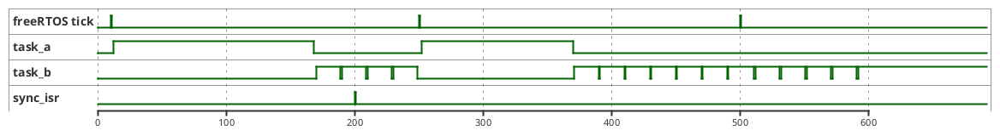
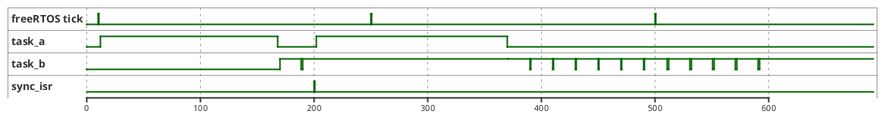

最近在使用freertos的一个嵌入式平台中同步freertos中的任务与一个外部中断信号，这里记录下测量学习的过程：

<!--more-->

freertos的时钟驱动freertos的任务调度，在freertos中高优先级的任务能够在发生任务调度时打断低优先级任务的执行，在任务被挂起后让出CPU的使用，系统切换到低优先级的任务执行上面， 其中`idle_task`是freertos中优先级最低的任务。


现在假设我们的系统里面新建了两个任务其中高优先级的任务为`task_a`, 低优先级的任务为`task_b`， 这两个任务都有下面的特性：

  * `task_a` : 这里`task_a`通过一种精准的延时的方式控制着这个系统的周期，即任务每两个freertos的tick后会被系统运行一次。

```C 
void task_a( void * pvParameters )
{
    TickType_t xLastWakeTime;
    /* task_a init here */
    
    xLastWakeTime = xTaskGetTickCount(); /* Initialise the xLastWakeTime variable with the current time */
    for( ;; )
    {
        //test_pin high
        /* Task code goes here. */
        //test_pin low
        vTaskDelayUntil( &xLastWakeTime, 2 );
    }
}
```
 
  * `task_b` : 这里的task_b 会占满系统的剩余时间导致比task_b 优先级更低的任务无法被系统调用运行。

```C 
void task_b( void * pvParameters )
{
    /* task_a init here */
    
    for( ;; )
    {
        //test_pin high
        /* Task code goes here. */
        //test_pin low
    }
}
```

这时系统的时序如下

```plantuml
@startuml
scale 100 as 150 pixels

binary "freeRTOS tick" as tick
binary "task_a" as a
binary "task_b" as b

@0
tick is low
a is low
b is low

@10
tick is high
a is low
b is low 

@11
tick is low
a is low
b is low

@12
tick is low
a is high
b is low

@168
tick is low
a is low
b is low

@169
tick is low
a is low
b is low

@170
tick is low
a is low
b is high

@189
tick is low
a is low
b is low

@190
tick is low
a is low
b is high

@209
tick is low
a is low
b is low

@210
tick is low
a is low
b is high

@229
tick is low
a is low
b is low

@230
tick is low
a is low
b is high

@249
tick is low
a is low
b is low

@250
tick is high
a is low
b is low

@251
tick is low
a is low
b is low

@252
tick is low
a is low
b is high

@271
tick is low
a is low
b is low

@272
tick is low
a is low
b is high

@291
tick is low
a is low
b is low

@292
tick is low
a is low
b is high

@311
tick is low
a is low
b is low

@312
tick is low
a is low
b is high

@331
tick is low
a is low
b is low

@332
tick is low
a is low
b is high

@351
tick is low
a is low
b is low

@352
tick is low
a is low
b is high

@371
tick is low
a is low
b is low

@372
tick is low
a is low
b is high

@391
tick is low
a is low
b is low

@392
tick is low
a is low
b is high

@411
tick is low
a is low
b is low

@412
tick is low
a is low
b is high

@431
tick is low
a is low
b is low

@432
tick is low
a is low
b is high

@451
tick is low
a is low
b is low

@452
tick is low
a is low
b is high

@471
tick is low
a is low
b is low

@472
tick is low
a is low
b is high

@491
tick is low
a is low
b is low

@492
tick is low
a is low
b is high

@500
tick is high
a is low
b is high

@501
tick is low
a is low
b is high

@502
tick is low
a is high
b is high

@670
tick is low
a is low
b is high

@680
tick is low
a is low
b is low

@681
tick is low
a is low
b is high

@699
tick is low
a is low
b is low
@enduml
```



> 这里通过这个时序图可以看出高优先级的任务可以在任务调度时获取CPU的执行时间，打断低优先级任务的执行

现在加入中断并修改任务a的代码如下

* 中断回调函数：

```C
void sync_isr( void * arg )
{
    //test_pin high
    /* ISR handle code goes here */
    //test_pin low
    /* Unblock the task by releasing the semaphore. */
    xSemaphoreGiveFromISR( xSemaphore, NULL);
}
```

* task_a :

```C
void task_a( void * pvParameters )
{
    /* task_a init here */
    for( ;; )
    {
        xSemaphoreTake( xSemaphore, LONGTIME);
        //test_pin high
        /* Task code goes here. */
        //test_pin low
    }
}
```
> 这里也可以使用 `vTaskNotifyGiveFromISR`或者`vTaskResume`来通过ISR启动任务。

这里系统时序图如下：



> 从上面的时序图可以看出在中断发生时并没有立即将CPU的时间切换到高优先级的任务`task_a`上面而是等到了下一次的任务调度才切换到`task_a`上面。从而可能会导致中断响应的不及时。

这里freeRTOS提供一个可以在传递信号量之后立即启动任务切换的能力，这里修改中断代码如下：

```C
void sync_isr( void * arg )
{
    //test_pin high
    /* ISR handle code goes here */
    //test_pin low
    /* Unblock the task by releasing the semaphore. */
    static BaseType_t xHigherPriorityTaskWoken;
    /* Is it time for vATask() to run? */
    xHigherPriorityTaskWoken = pdTRUE;
    xSemaphoreGiveFromISR( xSemaphore, &xHigherPriorityTaskWoken);
    /* start task scheduling */
    portYIELD_FROM_ISR( xHigherPriorityTaskWoken );
}
```

修改后系统的时序会变为如下：



> 这里在中断`isr`结束立即启动任务调度可以从上面时序图看出系统立即切换到`task_a`上面，保证了系统的实时性。
